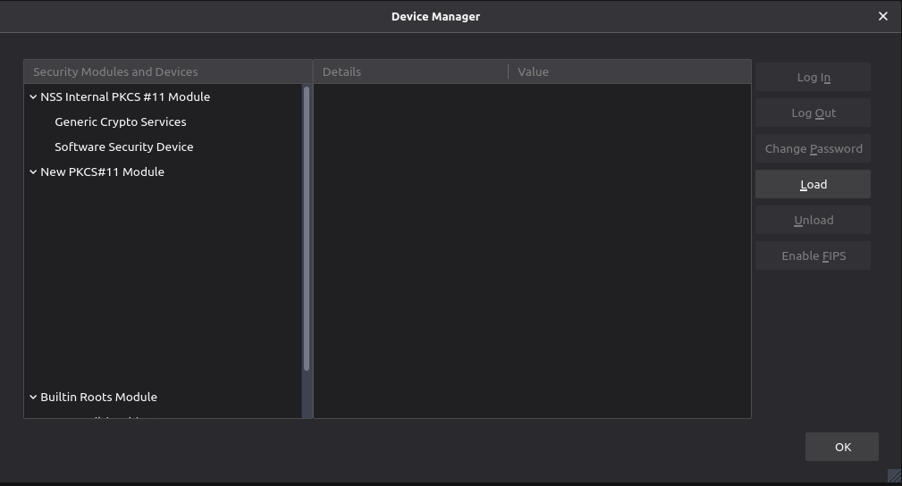

# safenet-linux

## Introduction

How to configure SafeNet eToken in Linux

### Prerequiste

* Safenet Authenfication Client >= 10.0 installed
* libnss3 and modutil (libnss3-tools)

### Tested On

* Ubuntu 18.04 (working on Chrome and Firefox)
* Ubuntu 20.04 (not working yet)
* Archlinux

### Recover the safenet eToken lib path

Once SafeNet is installed, recover the path of the safenet lib:

```bash
$ find /lib* /usr/lib* /usr/local/lib* -name "*libeToken.so*"
/usr/lib/libeToken.so.10.7.77
/usr/lib/libeToken.so.10
/usr/lib/libeToken.so
```

We will use the `/usr/lib/libeToken.so.10` for the example

## How to configure Firefox

Ppen Firefox and go to the security preferences (`about:preferences#privacy` in firefox navbar).

At the end of the page, click on `Security Devices` and a new window will appear:



Click on Load and enter the following informations:

* Module name: eToken PCKS#11 module
* Module Filename: `/usr/lib/libeToken.so.10`

Click Ok.

Firefow is now configured

## How to configure Chromium

Chromium does not offer a graphical interface to manage the PKCS devices. We will use libnss3-tools in order to configure it:

```bash
cd ~
modutil -dbdir sql:.pki/nssdb/ -add "eToken" -libfile /usr/lib/libeToken.so.10 # Will configure the token. Press enter if prompted
modutil -dbdir sql:.pki/nssdb/ -list # Check if the token appears in the list
```

If an error appear "NO DB FOUND", create the db:
```
mkdir -p ~/.pki/nssdb
modutil -dbdir sql:.pki/nssdb/ -create
```

Chromium is now configured
